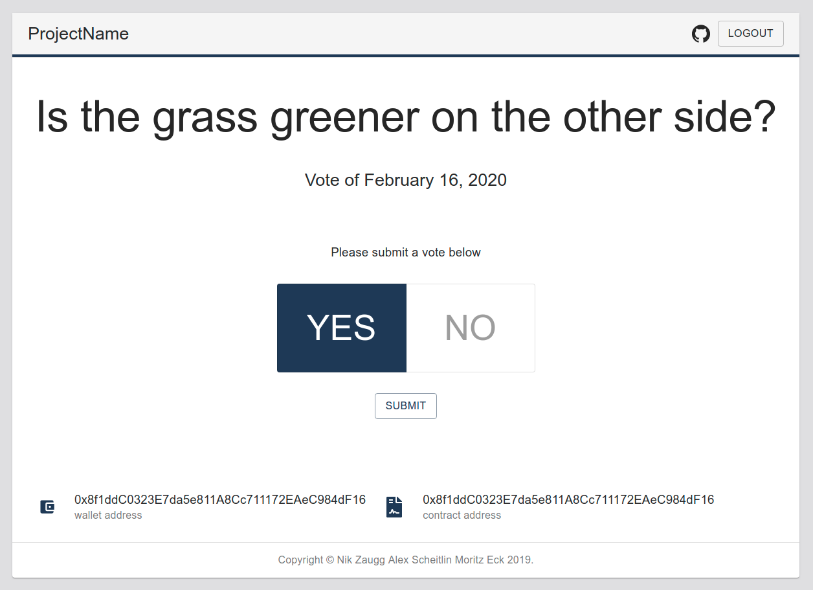
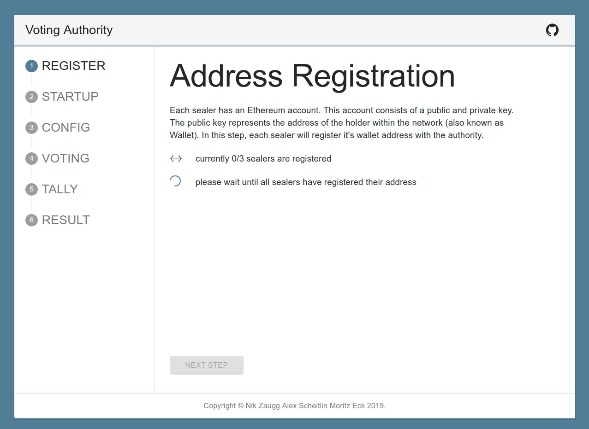
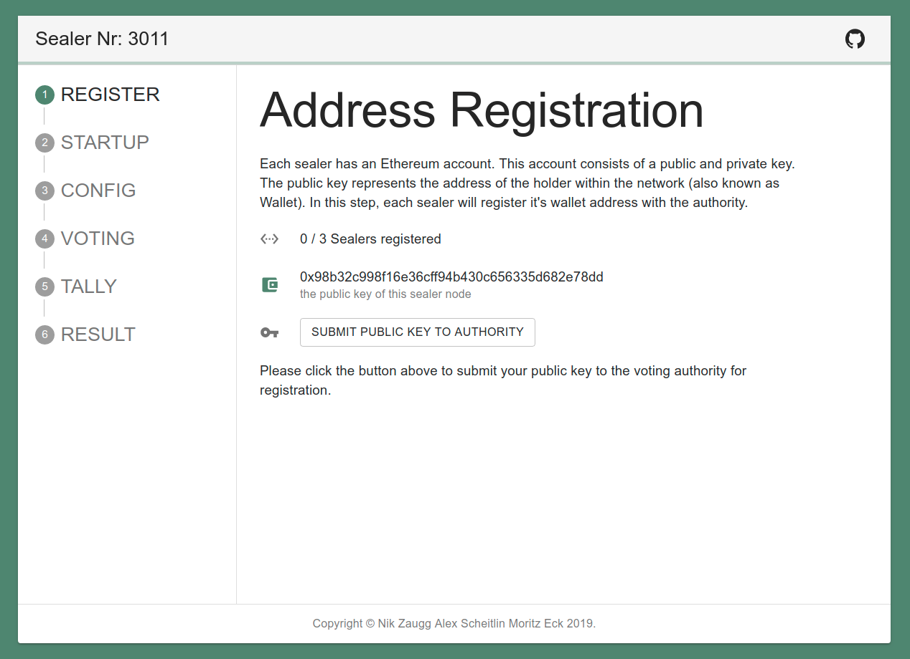
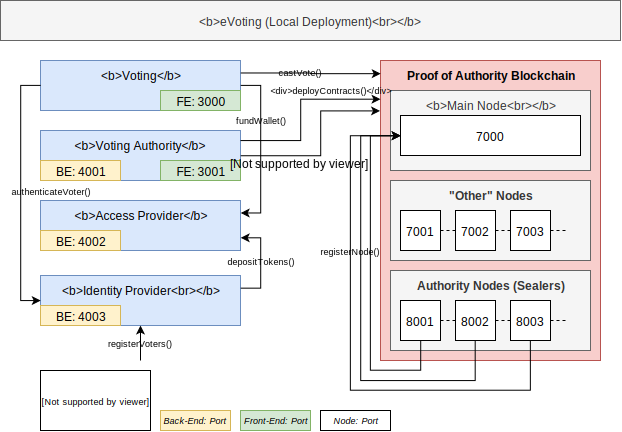

# Provotum (2.0)

|          Voter          |          Authority          |          Sealer          |
| :---------------------: | :-------------------------: | :----------------------: |
|  |  |  |

## Prerequisites

The following must be installed on your machine in order to run the whole setup.

- Node 12+
- npm
- jq (see below)
- docker
- docker-compose

Install JQ (https://stedolan.github.io/jq/download/) to process JSON in the command-line:

```bash
# ubuntu
sudo apt-get install jq

# fedora
sudo dnf install jq
```

### Crypto Private Github Package

Since the crypto library (evote-crypto) is a private npm package, you need to be logged in to the Github package registry in order to be able to download the package.
`npm login --registry=https://npm.pkg.github.com`

You will need a Github personal access token with `package:read, package:write` permission. Unlock this in your Github account.

#### Github Config JSON

Create a JSON file in the top-level folder (`/github.json`) which has the following structure, if it does not exist yet. Insert your credentials and personal information in there.

```json
{
  "github": {
    "user": "",
    "email": "",
    "token": ""
  }
}
```

## Initial Setup

`npm run lerna:install` to link packages in order for the husky hook to work

see https://github.com/alexscheitlin/master-project-sink/pull/30 for more details

## Modules



## How to run

Each subproject is configured to set and wire the PORTS automatically for every service that this subproject needs. For example: with `sealer/docker-start.sh`, the needed environment variables are fetched from `system.json` and written to `.env` files. These `.env` files are then used in `docker-compose.yml`.

#### Development Mode

Use `./docker-up.sh` and `./docker-down.sh` to start/stop all docker containers. This includes:

- one voting authority backend
- one voting authority frontend
- one identity provider backend
- one access provider backend
- three sealer/parity nodes

#### Production Mode

To use a production optimized mode, use `./docker-prod-up.sh` to start all docker containers. This includes the same setup as in the development mode.

### Voter Frontend

**Mode=Development (`localhost`)**

The frontend is **not dockerized** and will always be served on `localhost`.

```bash
cd voter-frontend
npm run start:localhost

# frontend will run on localhost:3000
```

### Voting Authority

**Mode=Development (`localhost`)**

In development mode, the frontend and backend will run on `localhost` for a better DX.

```bash
cd voting-authority/backend
npm run serve:localhost

# backend will run on localhost:4001
```

```bash
cd voting-authority/frontend
npm run start:localhost

# frontend will run on localhost:3001
```

**Mode=Docker (`docker`)**

In docker mode, the frontend and backend will run in docker-containers in the network (`172.1.1.0/24`) `e-voting`. This network is automatically created in the run scripts if it does not exist yet.

```bash
docker network ls

NETWORK ID    NAME      DRIVER   SCOPE
019cded65b2a  e-voting  bridge   local
```

```bash
cd voting-authority
./docker-start.sh

# backend will run on 172.1.1.41:4001
# frontend will run on 172.1.1.31:4001
```

### Access Provider

**Mode=Development (`localhost`)**

In development mode, the backend will run on `localhost` for a better DX.

```bash
cd access-provider-backend/
npm run serve:localhost

# backend will run on localhost:4002
```

**Mode=Docker (`docker`)**

In docker mode, the backend will run on `172.1.1.42:4002`.

```bash
cd access-provider-backend/
./docker-start.sh
```

### Identity Provider

**Mode=Development (`localhost`)**

In development mode, the backend will run on `localhost` for a better DX.

```bash
cd identity-provider-backend/
npm run serve:localhost

# backend will run on localhost:4003
```

**Mode=Docker (`docker`)**

In docker mode, the backend will run on `172.1.1.43:4003`.

```bash
cd identity-provider-backend/
./docker-start.sh
```

### Sealer

**Mode=Development (`localhost`)**

In development mode, the frontend and backend will run on `localhost` for a better DX.

```bash
cd sealer/backend
npm run serve:localhost

# backend will run on localhost:4011
```

```bash
cd sealer/frontend
npm run start:localhost

# frontend will run on localhost:3011
```

**Mode=Docker (`docker`)**

In docker mode, the frontend and backend will run in docker-containers in the network (`172.1.1.0/24`) `e-voting`. The frontends will run on `172.1.1.13[1-3]:301[1-3]`. The backends will run on `172.1.1.14[1-3]:401[1-3]`.

```bash
cd sealer
./docker-start.sh <sealerNr>

# example
./docker-start.sh 1 # will create backend and frontend for sealer 1
```

### Proof of Authority Blockchain

_Always runs dockerized_ ... so there is no distinction between development and production mode.

**Start 3 sealer nodes directly**

```bash
cd poa-blockchain/scripts
./dev-chain-parity-nodes.sh
```

all this script does, is call the following 3 times:

```bash
sealer/docker-start.sh <sealerNr>
```

the only thing that is different to starting all sealers on their own, is that `./dev-chain-parity-nodes.sh` will also connect the nodes for you directly.

### Solidity Contracts

**Project**: `contracts/`

```bash
npm run compile # compile contracts

npm run test # run tests in /test
```

The contracts are inside `contracts/contracts`. There, we can test them isolated with the truffle framework. With `npm run compile` all contracts will be compiled and a JSON representation of the contract will be put inside `contracts/compiled` (e.g., `Ballot.json`).

These `JSON` objects contain important information to interface with the contract once it is deployed on a chain.

The compiled contract `JSON` files will be automatically put into the folders that need them.

More details in `contracts/`

### ETH Blockchain Explorer

```bash
chmod +x ./docker-start.sh
./docker-start.sh
```

more details in: `ethstats/`

## Authors

- **Moritz Eck** - [meck93](https://github.com/meck93)
- **Alex Scheitlin** - [alexscheitlin](https://github.com/alexscheitlin)
- **Nik Zaugg** - [nikzaugg](https://github.com/nikzaugg)

## License

This project is licensed under the [MIT License](LICENSE).
