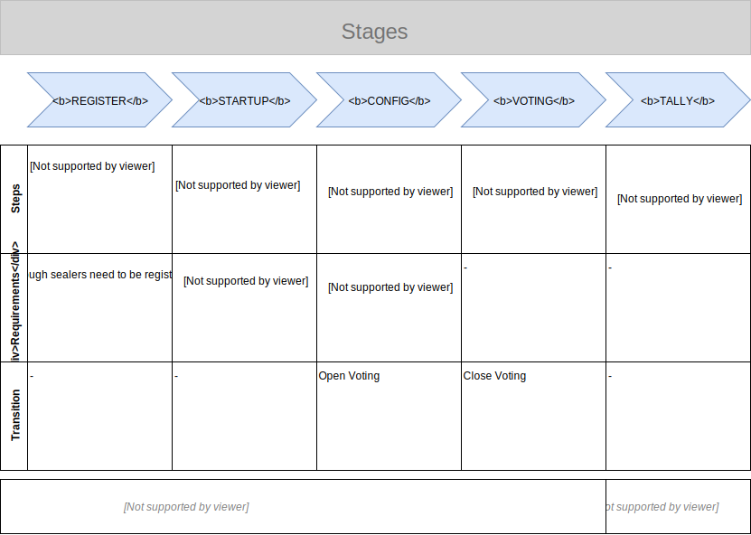

# Voting Authority Backend



## Prerequisites

- NodeJS 13+

## Required ENV Variables (.env)

Create the following files in the folder `/envs`:

```bash
# envs/.env.development

NODE_ENV=development
PORT=4001
```

```bash
# envs/.env.production

NODE_ENV=production
PORT=4001
passphrase=<replace with passphrase> # replace me
```

The production file additionally requires: `passphrase` (the passphrase to the certificate created beforehand).

## Development

Run `npm install` to install all required dependencies.

`npm run serve:dev` to start in http mode

`npm run serve:prod` to start in https mode

## Testing

Run `npm run test` to run all test of the project or `npm run test:watch` to continuously re-run the tests while developing.

## Solidity Contracts

**Important**: Contracts should be compiled inside `/contracts`. After that, copy `Ballot.json` and `ModuloMathLib.json` into `/toDeploy`.

### Deployment of contract

**POST** -> `/deploy` will deploy the Ballot contract onto the running chain and return the `address` of the `contract`

**GET** -> `/deploy` will return the `address` of the `contract` if it has already been deployed

### Handling of Contracts

To keep it consistent, this sub-project will not have any `.sol` files. All contracts are developed and tested in `voter-frontend`.

The contracts (in `JSON` format) in `voting-authority-backend/solidity/toDeploy` are ready for deployment. If something changed in the contracts, then they have to be compiled in `contracts` and copied into `voting-authority-backend/solidity/toDeploy`.

### Server Certificate

For the server to run in a realisitc setup (i.e. using HTTPS and TLS) a certificate is required.
Generate the certificate using:

```bash
# 1. Select what elliptic curve to use
openssl ecparam -list_curves

# 2. Generate the necessary public/private key pair (elliptic-curve)
openssl ecparam -name {name_of_the_curve} -genkey -out key.pem

# 3. Create a new certificate
openssl req -x509 -new -key key.pem -out cert.pem -days 365 -nodes -SHA384
```

Place the certificate and key in the folder: `./keys/cert` and add the passphrase to the `.env.production` file.
