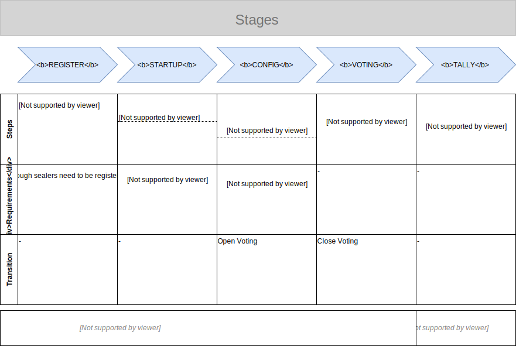

# Voting Authority Backend



## Prerequisites

- see root project

## How to run

**Mode=Development (`localhost`)**

In development mode, the backend will run on `localhost` for a better DX.

```bash
npm run serve:localhost

# backend will run on localhost:4001
```

**Mode=Production (`docker`)**

Please see instructions in root folder on how to run the dockerized version. This will always also include the frontend.

## Testing

Run `npm run test` to run all test of the project or `npm run test:watch` to continuously re-run the tests while developing.

## Solidity Contracts

**Important**: Contracts should be compiled inside `/contracts`. After that, copy `Ballot.json` and `ModuloMathLib.json` into `/toDeploy`.

### Endpoint

TODO

### Contracts

See README in root folder

<!--
### Server Certificate

For the server to run in a realisitc setup (i.e. using HTTPS and TLS) a certificate is required.
Generate the certificate using:

```bash
# 1. Select what elliptic curve to use
openssl ecparam -list_curves

# 2. Generate the necessary public/private key pair (elliptic-curve)
openssl ecparam -name {name_of_the_curve} -genkey -out key.pem

# 3. Create a new certificate
openssl req -x509 -new -key key.pem -out cert.pem -days 365 -nodes -SHA384
```

Place the certificate and key in the folder: `./keys/cert` and add the passphrase to the `.env.production` file. -->
