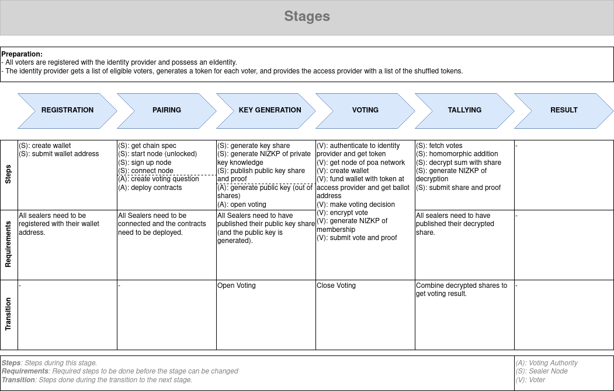

# Voting Authority Backend



## Prerequisites

- see root project

## How to build the container

The development mode backend container can be built with the following command:
`DOCKER_BUILDKIT=1 docker build -t vote-auth-backend --build-arg GITHUB_TOKEN=<GITHUB_PERSONAL_TOKEN> --build-arg GITHUB_USER=<GITHUB_USERNAME> --build-arg GITHUB_EMAIL=<GITHUB_EMAIL> .`

This requires that you have access to the private package repository on Github. Additionally, you will need a personal access token with rights: `package:read, package:write`. You can use your Github username and email address.

## How to run

**Mode=Development (`localhost`)**

In development mode, the backend will run on `localhost` for a better DX.

```bash
npm run serve:localhost

# backend will run on localhost:4001
```

**Mode=Production (`docker`)**

Please see instructions in root folder on how to run the dockerized version. This will always also include the frontend.

## Testing

Run `npm run test` to run all test of the project or `npm run test:watch` to continuously re-run the tests while developing.

## Solidity Contracts

**Important**: Contracts should be compiled inside `/contracts`. After that, copy `Ballot.json` and `ModuloMathLib.json` into `/toDeploy`.

### Endpoints

```http
GET /state
```

Responses depending on the state:

**VotingState.REGISTER**:

```javascript
200: "ok"
{
    "state"             : "REGISTER",
    "registeredSealers" : number,
    "requiredSealers"   : number
}
```

**VotingState.STARTUP**:

```javascript
200: "ok"
{
    "state"            : "STARTUP",
    "connectedSealers" : number,
    "signedUpSealers"  : number,
    "requiredSealers"  : number,
    "question"         : string
}

500: "number of connected sealers could not be fetched"
{
    "state" : "STARTUP",
    "msg"   : string
}
```

**VotingState.CONFIG**:

```javascript
200: "ok"
{
    "state"              : "CONFIG",
    "submittedKeyShares" : number,
    "requiredKeyShares"  : number,
    "publicKey"          : number
}

500: "number of submitted public key shares could not be fetched"
{
    "state" : "CONFIG",
    "msg"   : string
}
```

**VotingState.VOTING**:

```javascript
200: "ok"
{
    "state"          : "VOTING",
    "question"       : string,
    "votesSubmitted" : number
}

500: "number of votes could not be fetched"
{
    "state" : "VOTING",
    "msg"   : string
}
```

**VotingState.TALLY**:

```javascript
200: "ok"
{
    "state"                    : "TALLY",
    "submittedDecryptedShares" : number,
    "requiredDecryptedShares"  : number
}

500: "number of decrypted shares could not be fetched"
{
    "state" : "TALLY",
    "msg"   : string
}
```

**VotingState.RESULT**:

```javascript
200: "ok"
{
    "state"    : "RESULT",
    "yesVotes" : number,
    "noVotes"  : number
}

500: "number of votes could not be fetched"
500: "number of yes votes could not be fetched"
{
    "state" : "RESULT",
    "msg"   : string
}
```

```http
POST /state
```

Responses and actions depending on the state:

**VotingState.REGISTER**:

```javascript
201: "created"
{
    "state" : "STARTUP",
    "msg"   : string
}

400: "not enough sealer wallets registered"
{
    "state" : "REGISTER",
    "msg"   : string
}
```

=> change to `STARTUP` state

**VotingState.STARTUP**:

```javascript
201: "created"
{
    "state" : "CONFIG",
    "msg"   : string
}

400: "not enough sealers connected"
400: "ballot contract not deployed"
{
    "state" : "STARTUP",
    "msg"   : string
}

500: "number of connected sealers could not be fetched"
{
    "state" : "STARTUP",
    "msg"   : string
}
```

=> change to `CONFIG` state

**VotingState.CONFIG**:

```javascript
201: "created"
{
    "state" : "VOTING",
    "msg"   : string
}

400: "not enough public key shares submitted"
400: "public key not generated"
{
    "state" : "CONFIG",
    "msg"   : string
}

500: "number of public key shares could not be fetched"
500: "ballot could not be opened"
{
    "state" : "CONFIG",
    "msg"   : string
}
```

=> open ballot contract

=> change to `VOTING` state

**VotingState.VOTING**:

```javascript
201: "created"
{
    "state" : "TALLY",
    "msg"   : string
}

500: "ballot could not be closed"
{
    "state" : "VOTING",
    "msg"   : string
}
```

=> close ballot contract

=> change to `TALLY` state

**VotingState.TALLY**:

```javascript
201: "created"
{
    "state" : "RESULT",
    "msg"   : string
}

400: "not enough decrypted shares submitted"
{
    "state" : "TALLY",
    "msg"   : string
}

500: "number of decrypted could not be fetched"
500: "decrypted shares could not be combined"
500: "voting result not available"
{
    "state" : "TALLY",
    "msg"   : string
}
```

=> combine decrypted shares

=> change to `RESULT` state

### Contracts

See README in root folder

<!--
### Server Certificate

For the server to run in a realisitc setup (i.e. using HTTPS and TLS) a certificate is required.
Generate the certificate using:

```bash
# 1. Select what elliptic curve to use
openssl ecparam -list_curves

# 2. Generate the necessary public/private key pair (elliptic-curve)
openssl ecparam -name {name_of_the_curve} -genkey -out key.pem

# 3. Create a new certificate
openssl req -x509 -new -key key.pem -out cert.pem -days 365 -nodes -SHA384
```

Place the certificate and key in the folder: `./keys/cert` and add the passphrase to the `.env.production` file. -->
